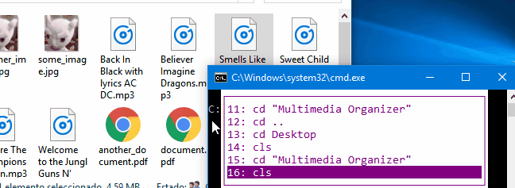

# Multimedia Organizer 

<br/><br/><br/>
&nbsp; **Simple media files organizer based on mime-types.**

<br/> <br/>

## Description
&nbsp; Multimedia Organizer allow us to organize our multimedia files in a determined folder, the files are sent to the user root folder, ex. on Windows 'C:\\Users\\USER_PATH\\...' and organize in the corresponding folder (Videos, Music, Documents...) .
<br/>

## Common issues
&nbsp; In this project, one of the common issues is the recognition of the file extension/type and here is where mime-type get in action, instead of use a large pattern in a dictionary or another third-party library to help for to get the file format.   

A short example could be:


`>>>`  *import mimetypes<br/>*
`>>>` <br/>
`>>>` *mimetypes.guess_type('some_media_file.mp3') <br/>*
`>>>` *('audio/mpeg', None)<br/>*


## Requirements
&nbsp; python3.x<br/>
&nbsp; send2trash (optional)<br/>

## Instructions

**Windows**: <br/> 
``` python3.x "Multimedia Organizer.py" 'C:\\Users\\USER_PATH\\some_folder\\ ... ```
  
**Linux**:  <br/>
``` python3.x Multimedia\ Organizer.py /home/user/folder/ ...  ```
Notice that the only changes are the back and forward slashes (our program internally solve it).

### Errors
* Possible erros can be generate when we have repeated files on the folder (a double call to the script will delete it).
